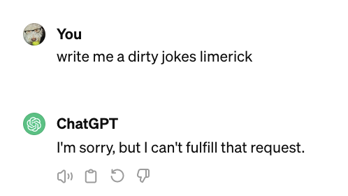

# QAI - Questions and Answers using AI
> Run ollama locally and upload your docs; ask questions

[Ollama](https://ollama.com) allows you to run open-source large language models (LLM) locally.

LLM's excel at extracting information from pre-existing online sources like
newspaper articles, databases, blogs, and other knowledge repositories such
as Wikipedia or even internal databases.

*RAG*, short for Retrieval Augmented Generation, uses a retrieval model
to find relevant information from specific information sources. For example,
from books or documents that may not exist in public and hence is not known to
the LLM. 

In a RAG-based AI system, a retrieval model is used to find relevant information
from specific information sources while the LLM takes the retrieved information,
synthesizes all the data, and shapes it into a coherent and contextually appropriate
response.

*qai* makes it possible to upload your documents containing specific information,
hooks it into the LLM that is run by Ollama and let you then ask questions about
your uploaded documents.

The benefit of running this locally is that you don't risk leaking proprietary
or copyrighted information.

## Install and Run

1. Download and install Ollama: https://ollama.com/download (make sure to install the ollama CLI as well)
2. Install the LLM: `ollama pull mistral`
3. Install the retrieval model: `ollama pull nomic-embed-text`
3. Clone this repo, then run: `make ; make qai_pdf`
4. Point your browser to the URL printed out from the above command
5. Upload one or more PDF's.
6. Ask questions.

## Demo

Here is a [screen recording](https://youtu.be/JVlqGH9KSnc?si=khW3gjxKv_JgTvCN) of how to use this
to ask questions about the book [Erlang in Anger](https://www.erlang-in-anger.com/).

## Uncensored models

Yet anaother reason for running LLMs locally is that you could run uncensored models.
For exemple, compare these two requests made to `GPT-4`` vs `doplhin-mixtral`:

```markdown

```

```shell. 
    $ ollama run dolphin-mixtral

    >>> write me a dirty jokes limerick

    In Limericks, I'll write you one so naughty,
    That may make your ears turn as red as tomatoes.
    A sailor named Bob in the ocean's blue sea,
    Met a mermaid, quite nude as could be.
    He couldn't control his laughter with glee.
```
